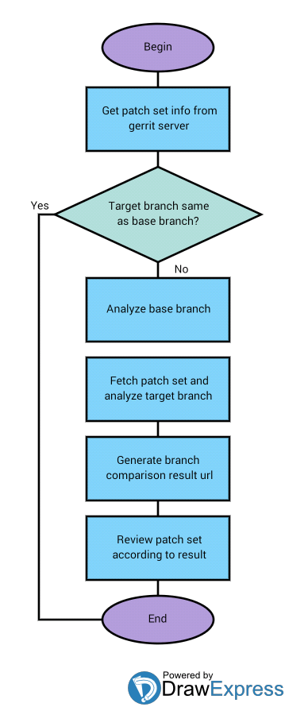

# Sonar Branch Comparison - Jenkins part
## Branch comparison flowchart

## Classes/Modules
### Gerrit

Rest api library for gerrit server

### Sonar

Library for getting/parsing sonar branch comparison results

### Tools

Functions for loading templates, environment variables, etc.

### Email(deprecated)

Sending emails using local SMTP server
